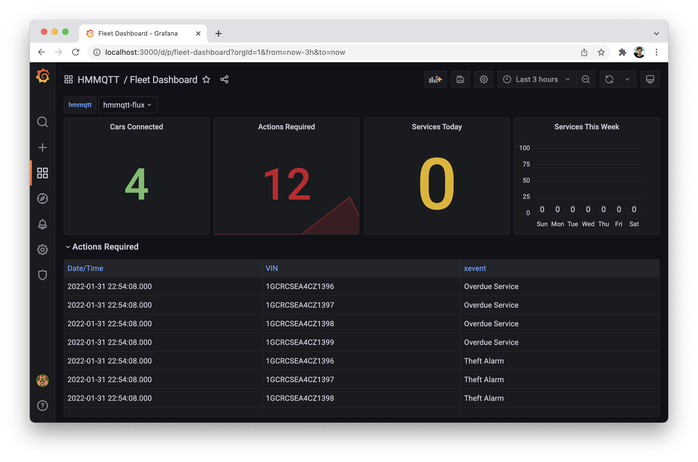

# High Mobility MQTT fleet dashboard sample

This repo includes a sample Docker app, which uses the High Mobility MQTT broker to receive connected car data and that presents the vehicle health status in a fleet dashboard.

The project is set up by three main components:

1. Telegraf MQTT client that consumes the [MQTT broker](https://docs.high-mobility.com/guides/getting-started/mqtt/) from High Mobility and parses the Auto API data format
2. InfluxDB that persists all vehicle data that is being streamed to Telegraf
3. Grafana with a customized fleet dashboard to visualise the car data and to create notification rules based vehicle events



## Getting started

### Install Docker
Make sure you have installed Docker Engine/Docker Desktop. You can get it from: https://docs.docker.com/get-docker/

### Credentials
All access credentials are coming from the InfluxDB environment configuration:

* Modify influxdb setup parameters in [env.env](./influxdb/env.env) to configure your own
* Token, org, bucket are reused in the telegraf configuration and in the grafana provisioning
  
#### InfluxDB
Login: [Access InfluxDB](http://localhost:8086)
* username: [DOCKER_INFLUXDB_INIT_USERNAME](./influxdb/env.env)
* password: [DOCKER_INFLUXDB_INIT_PASSWORD](./influxdb/env.env)

#### Grafana 
Login: [Access Grafana](http://localhost:3000/d/p/fleet-dashboard?orgId=1)

* Default username: `admin`
* Default password: `admin`

### High Mobility MQTT broker TLS
Authentication to the MQTT broker and the High Mobility platform is done with certificates. Follow these steps to configure Telegraf with your application credentials.

* Download MQTT broker client certificates: [See instructions in our docs](https://docs.high-mobility.com/guides/getting-started/mqtt/)
* Extract certificates into the [./tls/](./tls) directory
  * This directory is mounted to Telegraf and also to the MQTT container
  * You should have following files:
    * <client-id>-ca_certificates.pem
    * <client-id>-certificate.pem.crt
    * <client-id>-private.pem.key
* Lastly make these changes in the Telegraf mqtt_consumer plugin configuration:
```
[[inputs.mqtt_consumer]]
  # TLS Configuration
  
  tls_ca = "/etc/telegraf/mqtt/<client-id>-ca_certificates.pem"
  tls_cert = "/etc/telegraf/mqtt/<client-id>-certificate.pem.crt"
  tls_key = "/etc/telegraf/mqtt/<client-id>-private.pem.key"
  
  ## Use TLS but skip chain & host verification
  # insecure_skip_verify = false

  persistent_session = true
  client_id = "<client-id>" # Do not forget to define your clientId
  servers = ["ssl://mqtt.high-mobility.com:8883"]
  ...
```

### Docker Compose Deploy
Start all services:
```
docker compose up
```

## Fleet Dashboard
The fleet dashboard is set up with the following panels:

### General
Panels:

 * Cars Connected 
 * Actions Required
 * Services Today
 * Services This Week

### Actions Required
Table panel that presents following events:
 
 * Crash incidents
 * Service overdue
 * Theft alarm

### Car Overview
Map panel where all vehicles are shown on a world map. As additional information the car location outside temperature is displayed when selecting a vehicle.

### Health Status 
Panels:

 * Overall - problematic cars count with overall % of total cout of cars 
 * Cars with warning lights
 * Cars with trouble codes

#### Car Services 
Panels:

 * Today
 * Services
 * Inspection
 * Oil Changes

## Demo data
It's possible to generate demo data by running the following script, which will publish MQTT messages for Telegraf.

Publish Messages with script: ([generate.sh](./data-generator/generate.sh)):

```
docker compose exec mqtt sh generate.sh
```

## Modify Telegraf topic filter
The Telegraf topic filter is set to: ```live/# ```. This will match all topics that start with ```live/```
If needed, you can modify Telegraf filter here and set any specific topic path that you are interested in: [telegraf.conf](./telegraf/telegraf.conf)

```
  topics = [
    "{environment}/{auto_api_level}/{app_id}/{vin}/{capability}/{action}/{property}"
  ]
```